The goal of this dinotree crate is to provide efficient broadphase collision querying. So let us look at some cold hard statistic on how it performs. 

# Test Setup

Before we can measure and compare performance of this algorithm, we have to come up with a good way to test it. We often want to see how performance degrades as the size of the problem increasing, but we also do not want to influence any other variables. In this way a spiral distribution of the bots is ideal. It allows us to grow the size of the problem without effecting the density of the bots. It also fills out the entire 2d space. 

The spiral distribution takes 3 inputs: 
n: the number of bots
horizontal_grow: the seperation between the bots as they are laied out.
spiral_grow: the rate at which the bots grown outward from the center.

We increase n to increase the size of the problem.
We can increase the spiral_grow to decrease the number of bots intersecting.

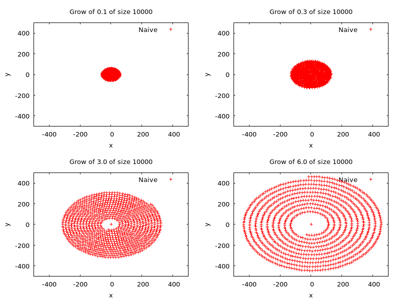

The below chart shows as influencing the spiral_grow effects the number of bot itersections. This shows that we can influence the spiral grown to see how the performance of the tree degrades the more clumped up the bots area.

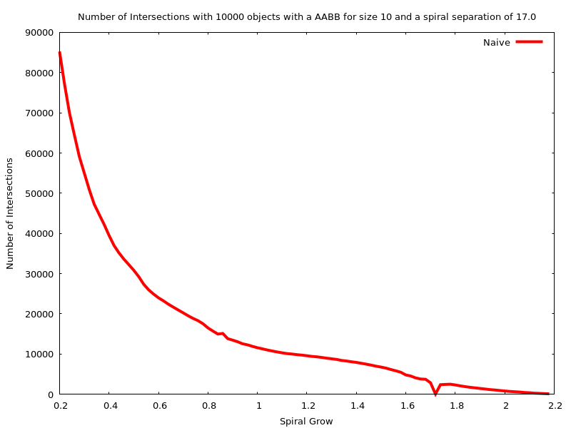

# Comparison against other Algorithms

The below chart compares different different algorithms both in terms of comparisons and benches. 

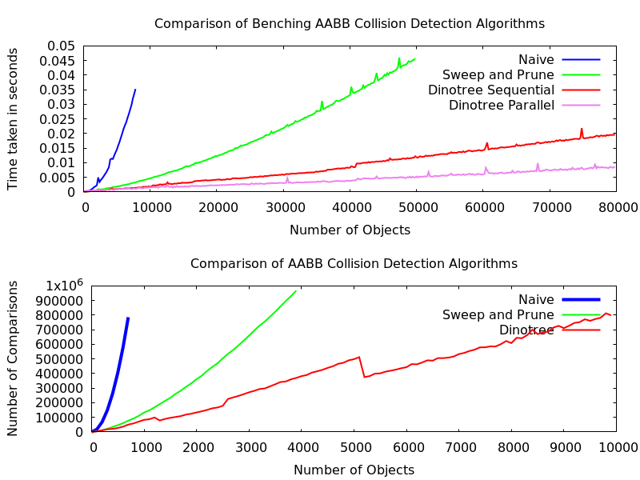

The below two charts shows a 3d view of the characteristics of naive,sweep and prune, and dinotree.

There are a couple of observations to make here. First, you might have noticed that the naive algorithm is not static with respect to the spiral grow. This is because the naive implementation I used isnt 100% naive. First I check if a pair of aabb's collides in one dimension. If it doesnt collide in that dimension, I do not even check the next dimention. So because of this "short circuiting", there is an increase in comparisons when the bots are clumped up. If there were no short-circuiting, it would be flat all across.

Another interesting observation is that these graphs show that sweep and prune has a better worst case than the dinotree algorithm. This makes sense since in the worst case, sweep and prune willl sort all the bots, and then sweep. In the worst case for dinotree, it will first find the median, and then sort all the bots, and then sweep. So the dinotree is slower since it redundantly found the median, and then sorted everything. However, it can be easily seen that this only happens when the bots are extremely clumped up (grow<=0.003). So while sweep and prune has a better worst-cast, the worst-cast scenario is rare and the dino-tree's worst case is not much worst. 

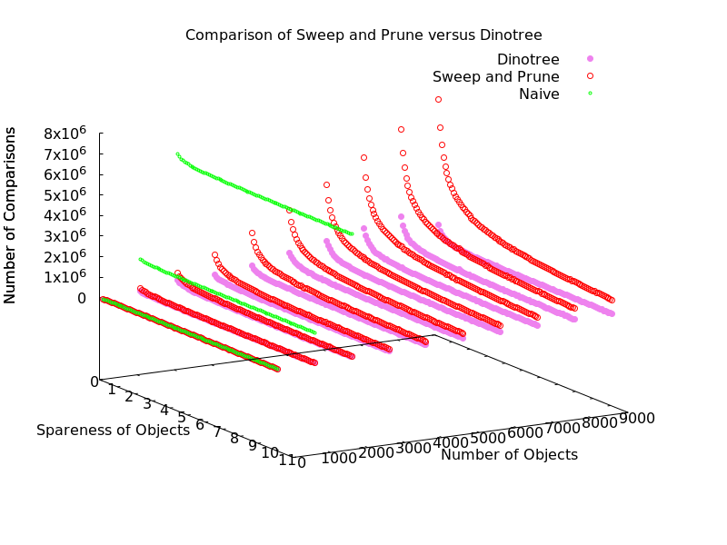
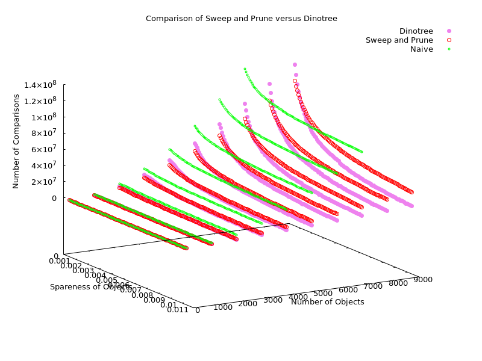

# Rebalancing vs Querying

The below charts show the load balance between the construction and querying on the dinotree.

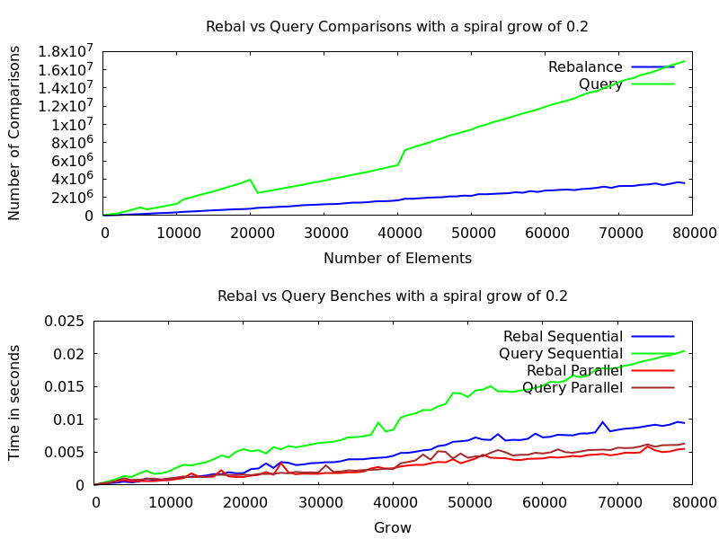
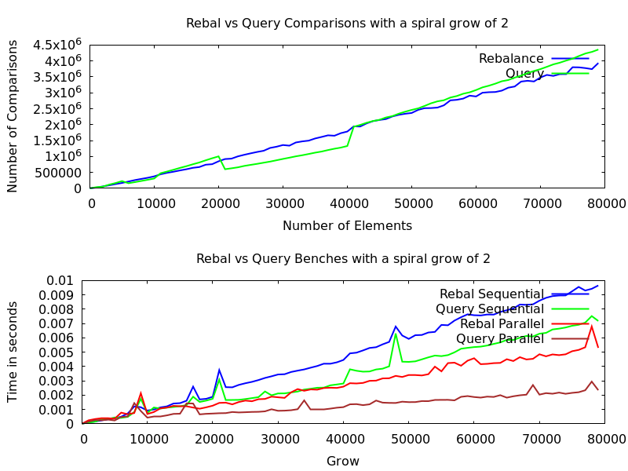
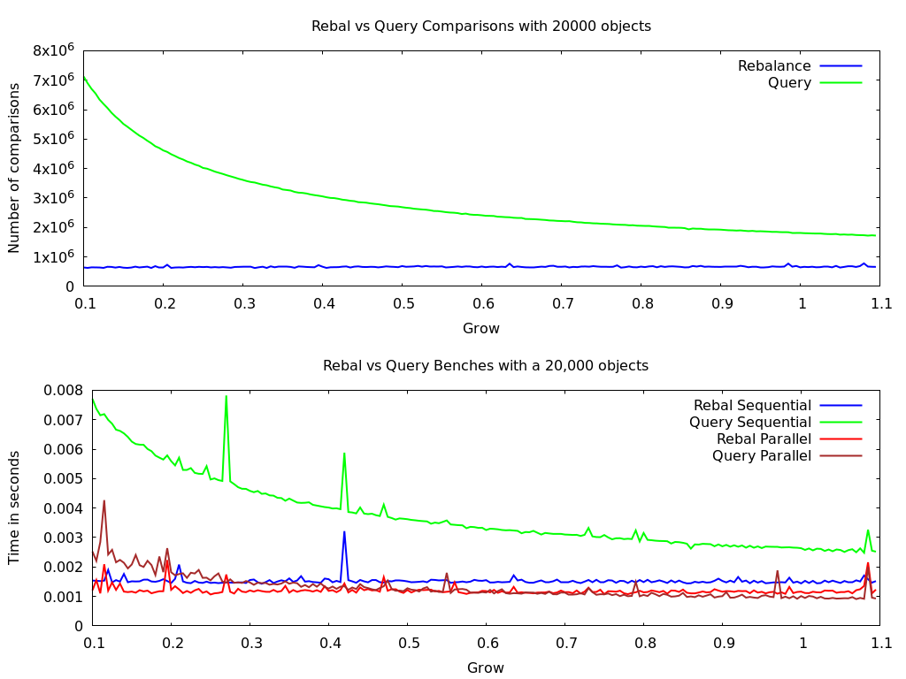

# Level Comparison
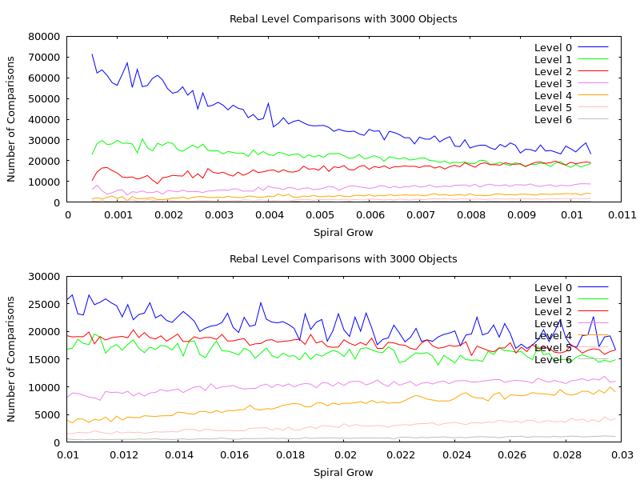
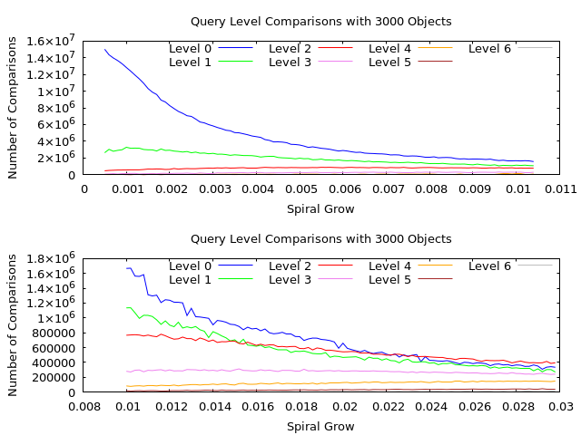

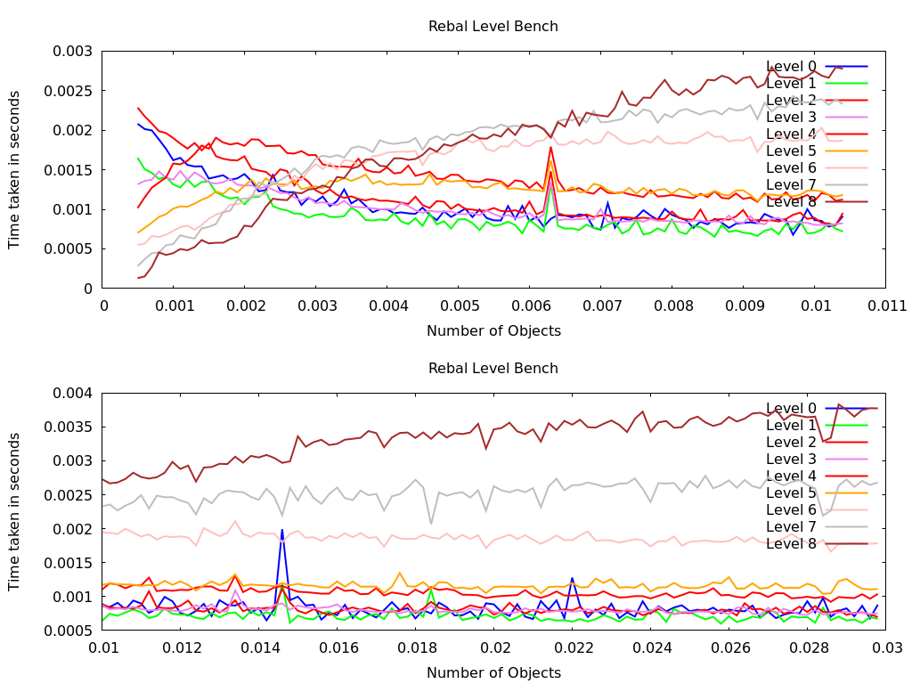
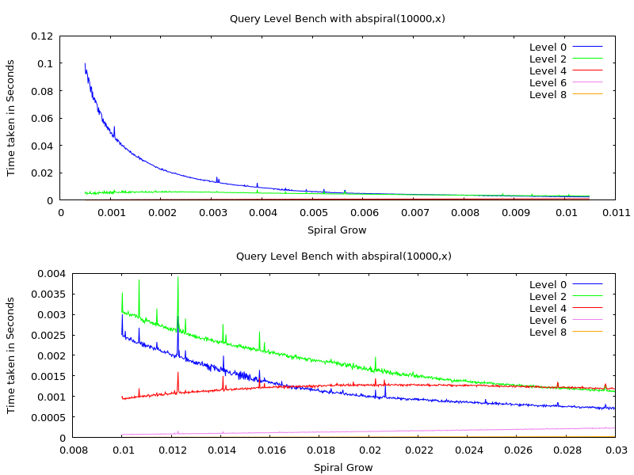

# Comparison of Tree Height

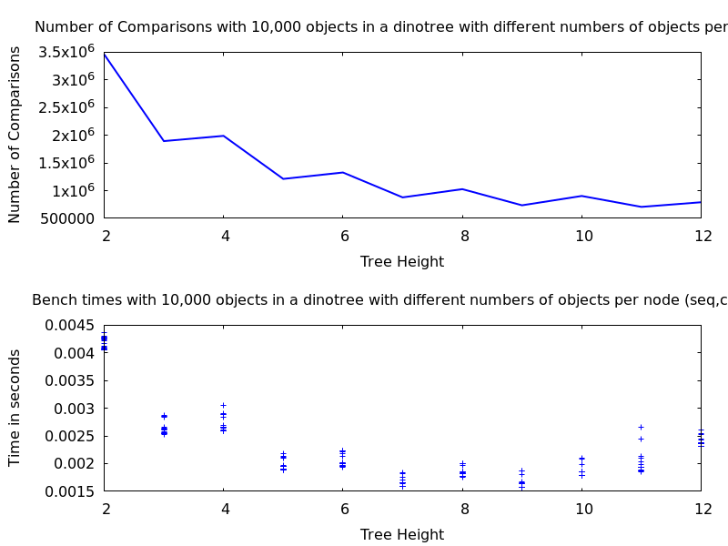
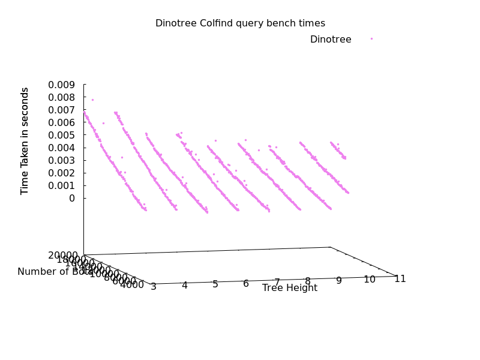
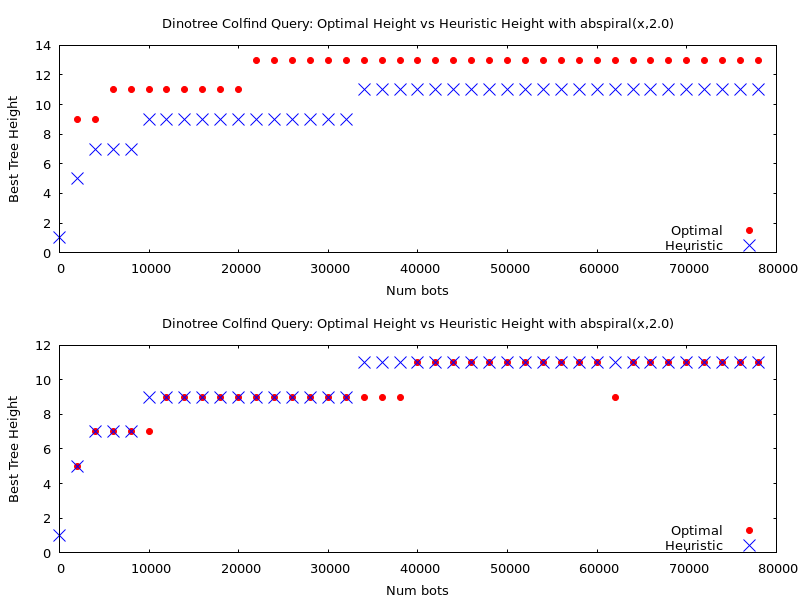
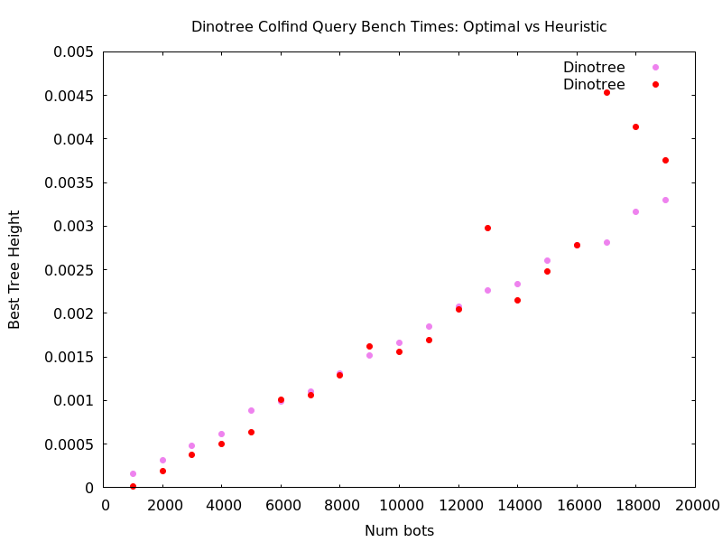

# Comparison of Parallel Height

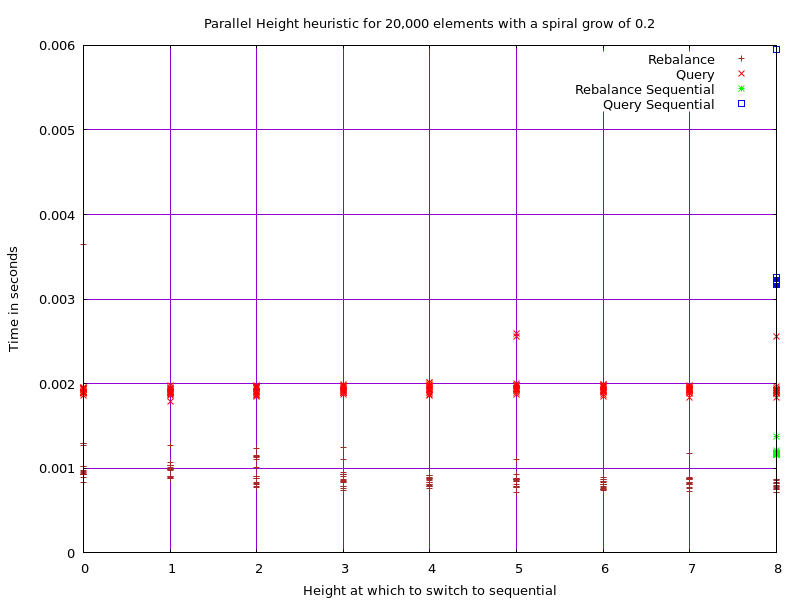

# Comparison of primitive types

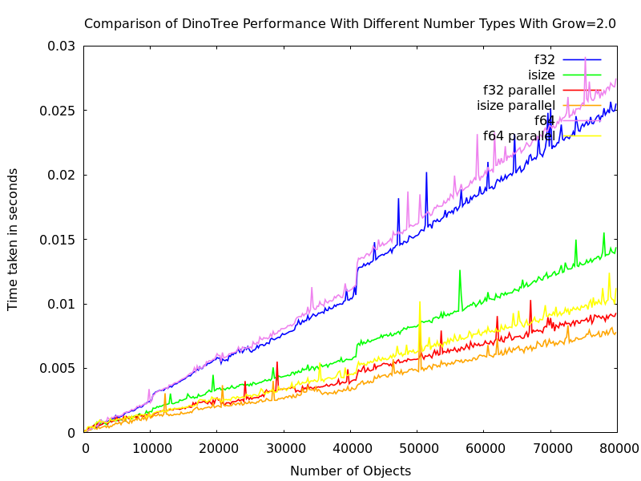

