The goal of this dinotree crate is to provide efficient broadphase collision querying. So let us look at some cold hard statistics on how it performs. 

# Test Setup

Before we can measure and compare performance of this algorithm, we have to come up with a good way to test it. We often want to see how performance degrades as the size of the problem increases, but we also do not want to influence any other variables. In this way a a simple Archimedean spiral distribution of the bots is ideal. It allows us to grow the size of the problem without effecting the density of the bots. It also fills out the entire 2d space. If all the bots were dstributed along only one dimension then that would also skew our results. For example, sweep and prune will perform very well if all the bots are spaced out along the axis we are sweeping.

The spiral distribution takes 3 inputs: 
n: the number of bots
separation: the seperation between the bots as they are laid out.
grow rate: the rate at which the bots grown outward from the center.

We increase n to increase the size of the problem.
We can increase the spiral_grow to decrease the number of bots intersecting.

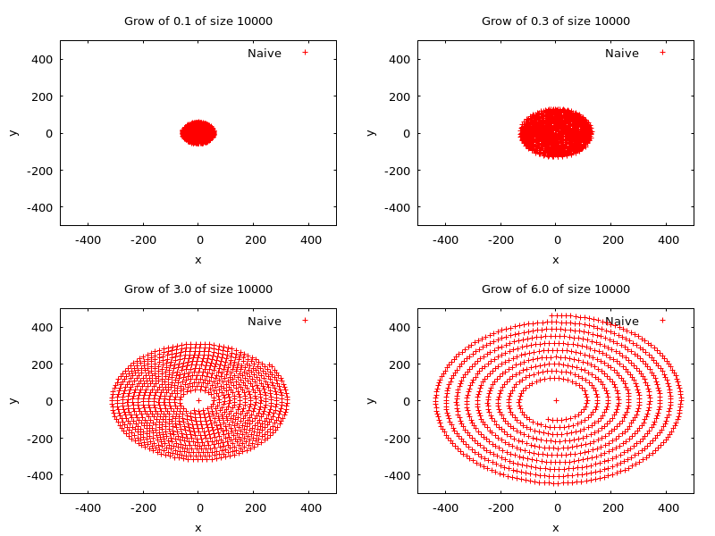

The below chart shows how influencing the spiral_grow effects the number of bot itersections. This shows that we can influence the spiral grow to see how the performance of the tree degrades. We could influcence how many bots are colliding with changing the separation, but the relationship to the grow rate and the number of intersection pairs makes a nice smooth downward graph.

It is not entirely smooth, but it is smooth enough that we can use this function to change the load on the dinotree without having to sample multiple times.

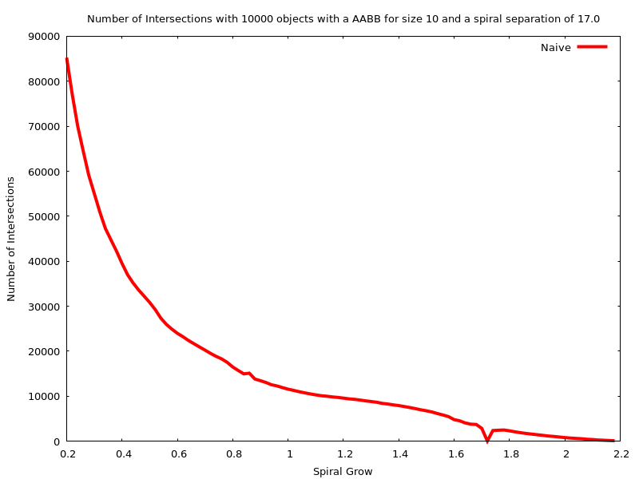

# Comparison against other Algorithms

The below chart compares different algorithms both in terms of comparisons and benches. The naive algorithm is clearly the slowest, with sweep and prune next followed by dinotree. What is interesting is that the real world bench times matches closely the theoretical number of comparisons. What this means is that the number of comparisisons performed is proportional to the real world performance of this algorithm. The lines are more smooth (and deterministic) than the benches since an everyday laptop has other things to do besides run this program. 

The way in which the benches are graphed is also a slight lie. Only one sample is taken for each different value of n, and the samples are taken in ascending order. This means that you can see trends in the graph where the cpu throttles, for example, and see if all happen in the same area in the graph. If more samples were taken of each n, and in a random order, this would not be apparent. But in reality this isnt that big of a deal, as long as we can clearly see a trend as n increases.

The jumps that you see in the theortical dinotree line are the points at which the trees height grows by one. It is a complete binary tree so a slight increase in the height by 1 causes a doubling of nodes so it is a drastic change. As the number of bots increases its inevitable that sometimes the tree will be too tall or too short. 

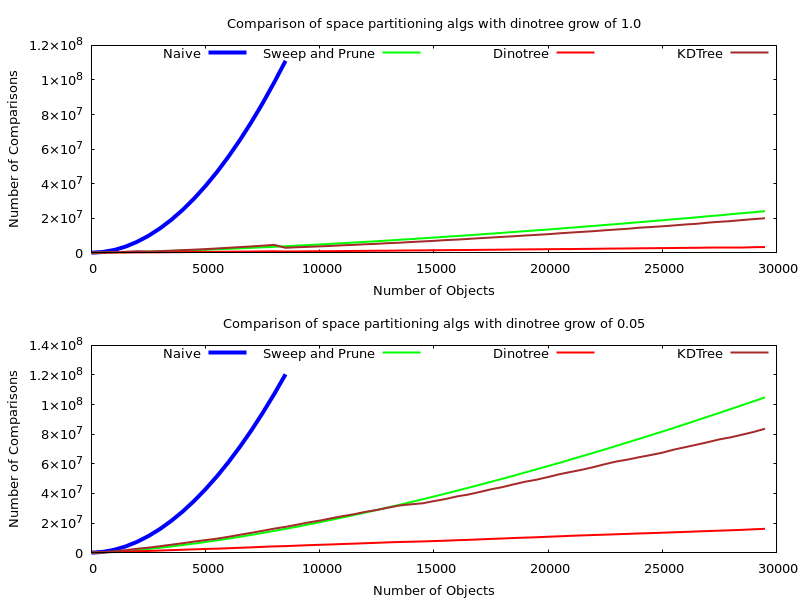
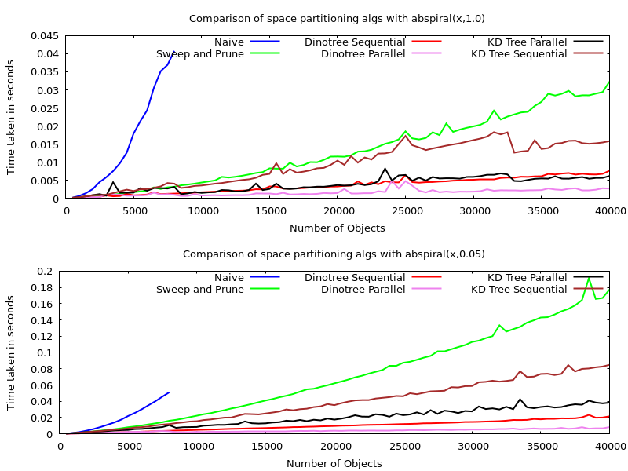

The below two charts shows a 3d view of the characteristics of naive, sweep and prune, and dinotree.

There are a couple of observations to make here. First, you might have noticed that the naive algorithm is not completely static with respect to the spiral grow. This is because the naive implementation I used isnt 100% naive. First I check if a pair of aabb's collides in one dimension. If it doesnt collide in that dimension, I do not even check the next dimention. So because of this "short circuiting", there is a slight increase in comparisons when the bots are clumped up. If there were no short-circuiting, it would be flat all across.

Another interesting observation is that these graphs show that sweep and prune has a better worst case than the dinotree algorithm. This makes sense since in the worst case, sweep and prune willl sort all the bots, and then sweep. In the worst case for dinotree, it will first find the median, and then sort all the bots, and then sweep. So the dinotree is slower since it redundantly found the median, and then sorted everything. However, it can be easily seen that this only happens when the bots are extremely clumped up (grow<=0.003). So while sweep and prune has a better worst-cast, the worst-cast scenario is rare and the dino-tree's worst case is not much worst (median finding + sort versus just sort). 

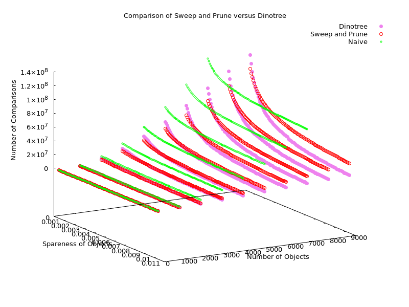

# Rebalancing vs Querying

The below charts show the load balance between the construction and querying on the dinotree.

Some observations:
* The cost of rebalancing does not change with the density of the objects
* The cost of querying does change with the density.
* If the bots are spread out enough, the cost of querying decreases enough to cost less than the cost of rebalancing.
* The cost of querying is reduced more by parallelizing than the cost of rebalancing.
	
	
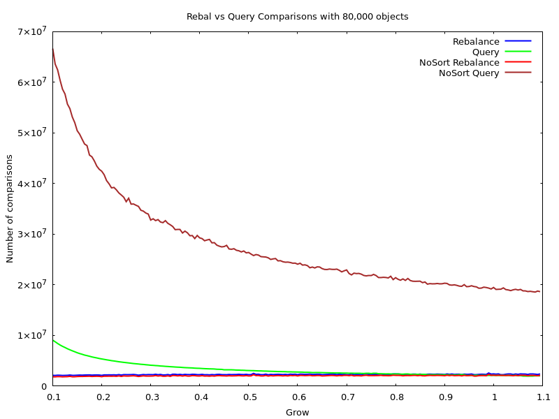
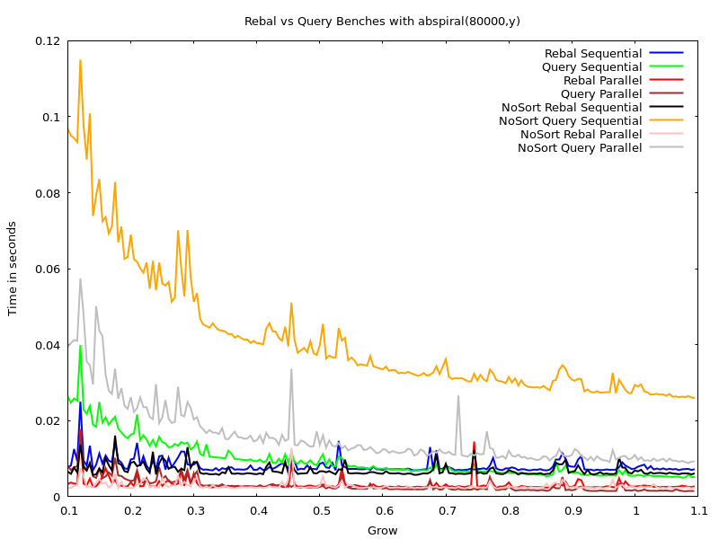

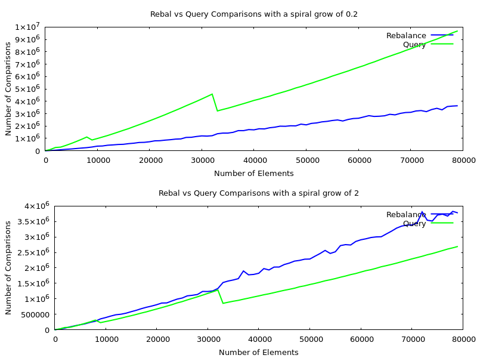
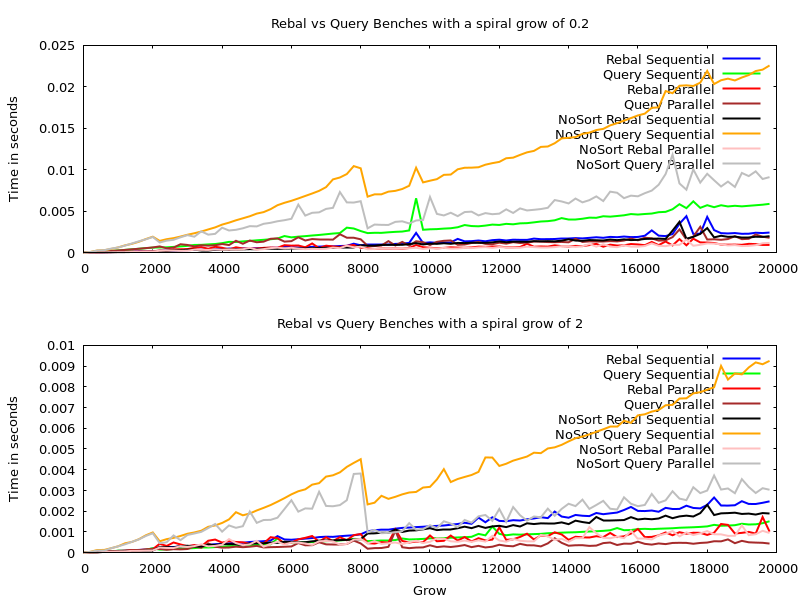

# Level Comparison

The below charts show the load balance between the different levels of the tree.

Some observations:
* The cost of rebalancing the first level is the most erratic.
* The load goes from the top levels to the bottom levels as the bots spread out more.
* The load on the first few levels is not high unless the bots are clumped up. Its acting like a sponge. The levels down the tree you go, the more even it gets.

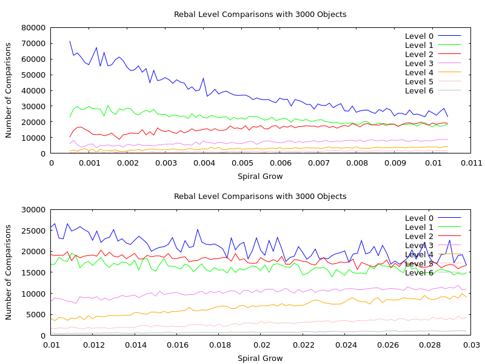
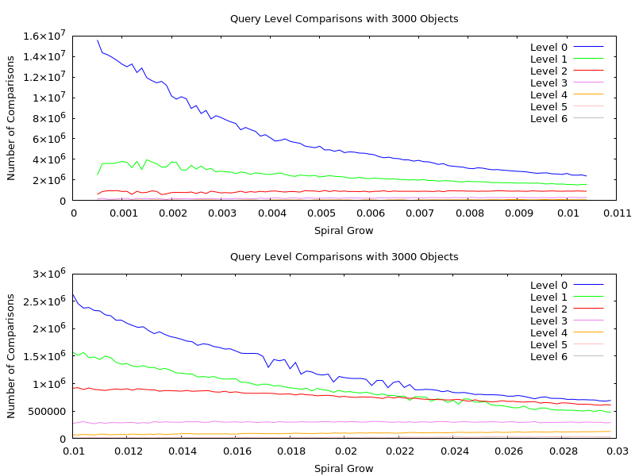

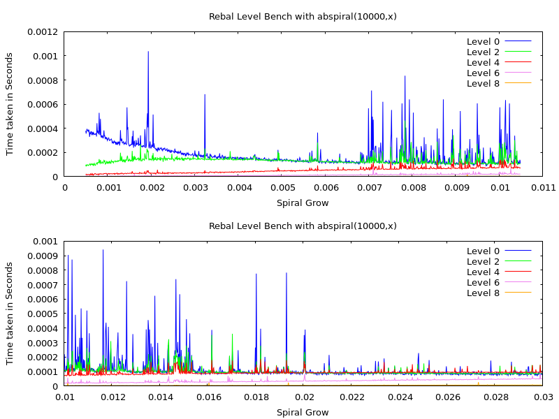
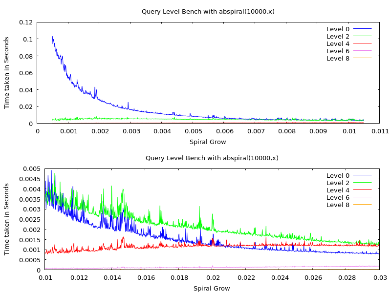

# Copy vs No Copy

todo talk about

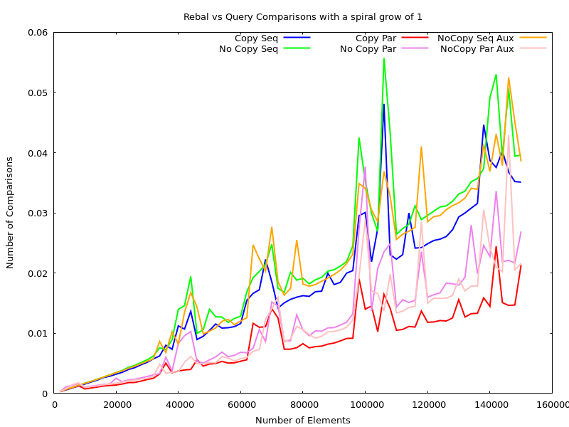

# Bounds checking vs no bounds checking

This shows the difference between using array indexing with and without bounds checking/unsafe.
As you can see, the no bounds checking version is faster, but it is by a negligable ammount.
Look at the xaxis. The difference is still only slight at 500_000 bots.

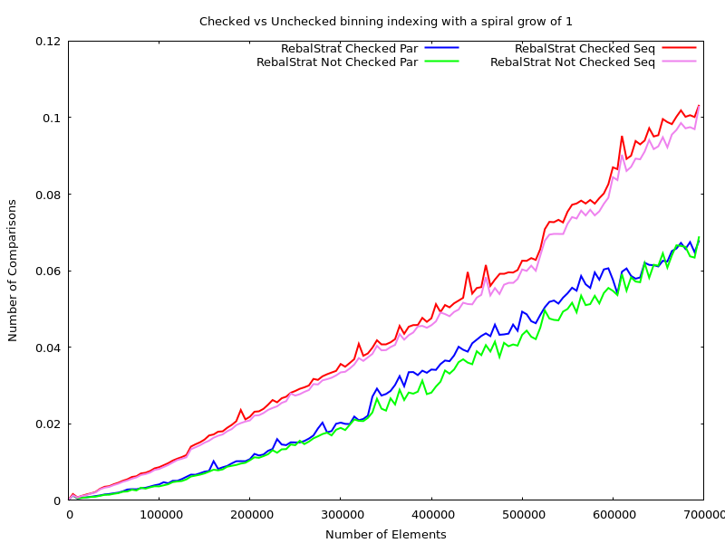

# Comparison of Tree Height

The below charts show the performance of the tree when manually selecting a height other than the default one chosen.
You can see that the theory is a downward curve, but the benching is more of a bowl. Theory would tell us to have a big enough height such that every leaf node had only one bot in it. But in the real world, this has a lot of overhead with recursive calls and memory. Instead the benching suggested a smaller height where the leaf nodes has a few bots in them.

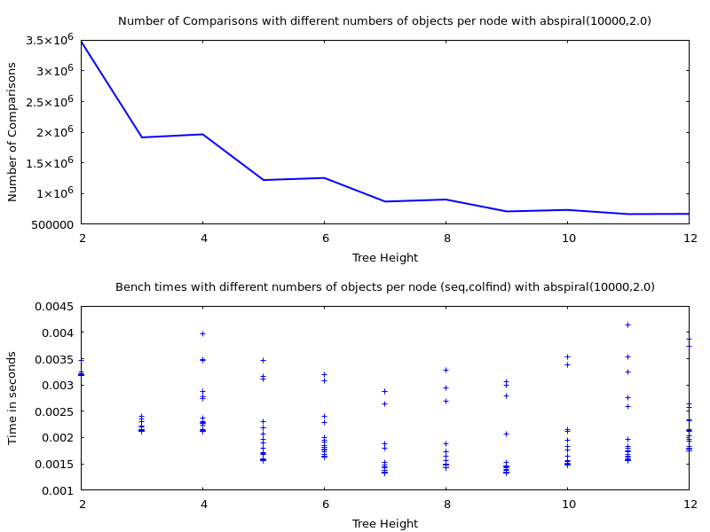

The below chart compare the empirically best height against the height that our heuristic tree height function produces. 

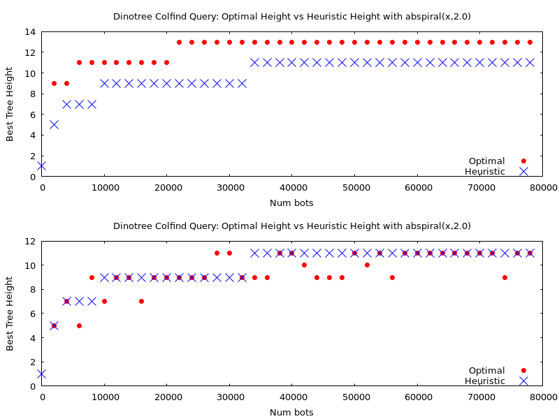

# Comparison of Parallel Height

The below chart shows the performance of the dinotree for different levels at which to switch to sequential.
Obviously if you choose to switch to sequential straight away, you have sequential tree performnace.

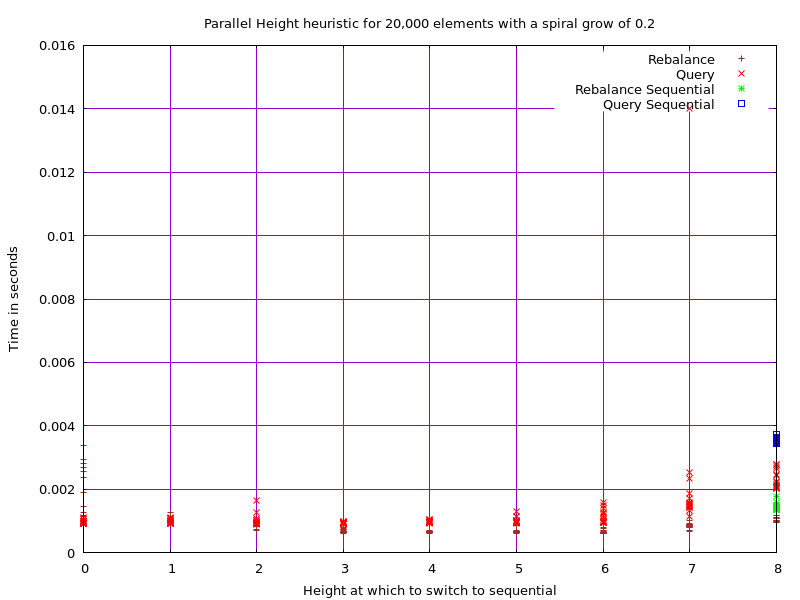

# Comparison of primitive types

The below chart shows performance using different primitive types for the aabbs. Notice that once parallelism is brought in, the differences between the types is not as big. It is also interesting of how fast sequential the integer run is compared to the other sequential primitive types.

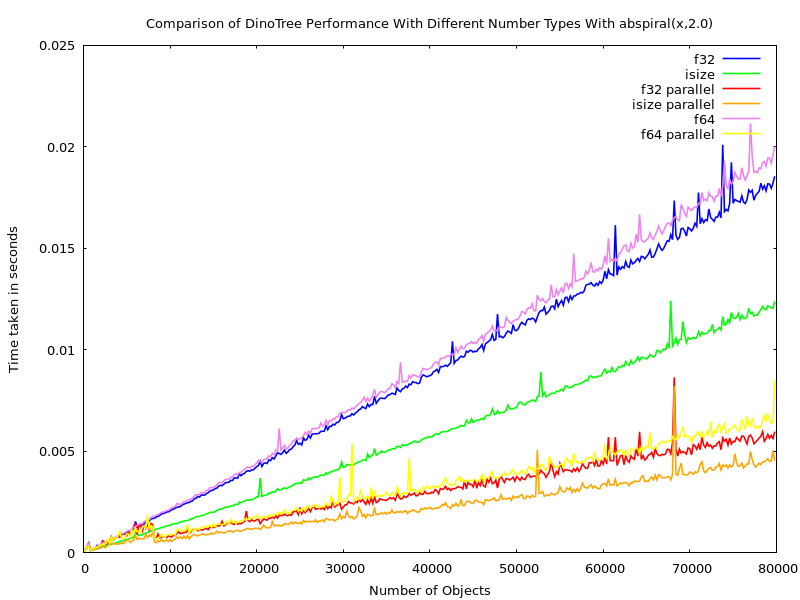

