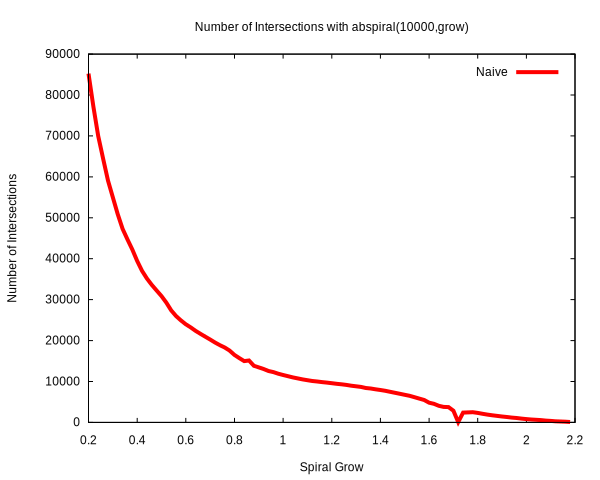
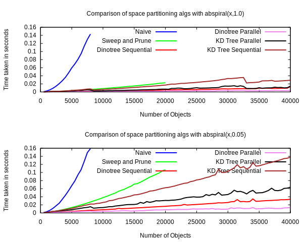
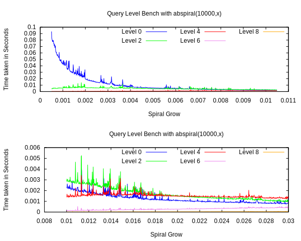

The goal of this dinotree crate is to provide efficient broadphase collision querying. So let us look at some cold hard statistics on how it performs. 

# Test Setup

Before we can measure and compare performance of this algorithm, we have to come up with a good way to test it. We often want to see how performance degrades as the size of the problem increases, but we also do not want to influence any other variables. In this way a simple Archimedean spiral distribution of the bots is ideal. It allows us to grow the size of the problem without affecting the density of the bots. It also fills out the entire 2d space. If all the bots were dstributed along only one dimension then that would also skew our results. For example, sweep and prune will perform very well if all the bots are spaced out along the axis we are sweeping.

The spiral distribution takes 3 inputs: 
* n: the number of bots
* separation: the seperation between the bots as they are laid out.
* grow rate: the rate at which the bots grow outward from the center.

We increase n to increase the size of the problem.
We can increase the spiral_grow to decrease the number of bots intersecting.

While those 3 variables change the the distribution of the elements, there is another variable at play.

* aabb size (the bounding box size of each element)

For a lot of the benching in here, we just fix the size such that every element has the same size aabb. There is still a lot of interesting data analysis to do with elements that are all different sizes, but for now we'll just analyse cases where they are all
the same.

Lets define a particular scene/distribution just so that it makes are benching simpler.

Let __abspiral(n,grow)__ be a distribution of bots where:
* n=number of bots
* grow=spiral grow rate
* separation=constant (17)
* aabb radius=constant (5)

The constants are just values I pulled out of thin air. We just want all the elements to have some bounding box size and to influence how many of them are intersecting. This just makes things simpler since for most of the benches, we can typically show trends what we want to show by only influencing these two variables, so we might as well pick constants for the other variables and imbue that in the meaning of abspiral() itself.

The below chart shows how influencing the spiral_grow affects the number of bot intersections for abspiral(). This shows that we can influence the spiral grow to see how the performance of the tree degrades. We could influence how many bots are colliding with changing the separation, but the relationship to the grow rate and the number of intersection pairs makes a nice smooth downward graph.

It is not entirely smooth, but it is smooth enough that we can use this function to change the load on the dinotree without having to sample multiple times.

# Comparison against other Algorithms

The below chart compares different algorithms both in terms of comparisons and benches. The naive algorithm is clearly the slowest, with sweep and prune next, then KD Tree followed by dinotree. It is interesting to note that the real world bench times matche closely with the theoretical number of comparisons. So that means that the number of comparisons performed is proportional to the real world performance of this algorithm. The lines are more smooth (and deterministic) than the benches since an everyday laptop has more tasks to do and might also throttle itself half way through a bench.

The way in which the benches are graphed is also slightly misleading. Every graph that graphs the load over size n does so first by benching for n=1, then n=2, n=3, etc. This means that you can see trends in the graph where the cpu throttles, for example, and see if all happen in the same area in the graph. If more samples were taken of each n, and in a random order, this would not be apparent. So for these graphs the x axis is n, but it's also in a way time. In reality this isn't that big of a deal, as long as we can clearly see a trend as n increases.

The jumps that you see in the theoretical dinotree line are the points at which the trees height grows by one. It is a complete binary tree so a slight increase in the height by 1 causes a doubling of nodes so it is a drastic change. As the number of bots increases it is inevitable that sometimes the tree will be too tall or too short. 

It's also worth noting that the difference between sweep and prune and kdtree and naive is much bigger than the difference between sweep and prune and kdtree and dinotree. So using these simpler algorithms gets you big gains as it is. The gains you get from using dinotree are not as pronounced, but are noticeable with more elements.

The below chart shows a 3d view of the characteristics of naive, sweep and prune, and dinotree.

There are a couple of observations to make here. First, you might have noticed that the naive algorithm is not completely static with respect to the spiral grow. This is because the naive implementation I used is not 100% naive. While it does check
every possible pair, it first checks if a pair of aabb's collides in one dimension. If it does not collide in that dimension, it does not even check the next dimension. So because of this "short circuiting", there is a slight increase in comparisons when the bots are clumped up. If there were no short-circuiting, it would be flat all across. However, it is clear from the graph that this short-circuiting optimization does not gain you all that much.

Another interesting observation is that these graphs show that sweep and prune has a better worst case than the dinotree algorithm. This makes sense since in the worst case, sweep and prune will sort all the bots, and then sweep. In the worst case for dinotree, it will first find the median, and then sort all the bots, and then sweep. So the dinotree is slower since it redundantly found the median, and then sorted everything. However, it is easy to see that this only happens when the bots are extremely clumped up (abspiral(grow) where grow<=0.003). So while sweep and prune has a better worst-cast, the worst-cast scenario is rare and the dino-tree's worst case is not much worse (median finding + sort versus just sort). 

# Bounds checking vs no bounds checking

This shows the difference between using array indexing with and without bounds checking / unsafe.
As you can see, the no bounds checking version is faster, but it is by a pretty negligible amount.
The scale of the xaxis shows that the difference isn't really noticeable until x is very big. That said,
you can still notice a clear difference between the two in the graph.

# Rebalancing vs Querying

The below charts show the load balance between the construction and querying on the dinotree.
It's important to note that the comparison isnt really 'fair'. The cost of querying depends a lot on
what you plan on doing with every colliding pair (it could be an expensive user calculation). Here we just use a 'reasonably' expensive calculation that repels the colliding pairs.

Some observations:
* The cost of rebalancing does not change with the density of the objects
* The cost of querying does change with the density.
* If the bots are spread out enough, the cost of querying decreases enough to cost less than the cost of rebalancing.
* The cost of querying is reduced more by parallelizing than the cost of rebalancing.
	
It makes sense that querying in more 'parallelilable' than rebalancing since the calculation that you have to perform for each node before you can divide and conquer the problem is more expensive for rebalancing. For rebalancing you need to find the median and bin the bots. For querying you only have to do sweep and prune. 

# Level Comparison

The below charts show the load balance between the different levels of the tree.

Some observations:
* The cost of rebalancing the first level is the most erratic. 
	I like to think of the algorithm as a sponge and the problem as water seeping through it.
	First you you have coarse filtering, then it gets more precise.
* The load goes from the top levels to the bottom levels as the bots spread out more.
* The load on the first few levels is not high unless the bots are clumped up. 

# Default vs Direct vs Indirect

Below are a bunch of diagrams that highlight differences between a couple variable:
Whether the elements inserted into the tree are made up of:

* `(Rect<Num>,&mut T)` (Default)
* `(Rect<Num>,T)` (Direct)
* `&mut (Rect<Num>,T)` (Indirect)

We also vary the size of `T` (8,32,128,or 256 bytes).
We do not bother varying the size of `Num` since we assume the user is using a
'normal' sized number type like a float or an integer.

We define a more specialized abspiral(), abspiral-isize() that takes an additonal
argument which influnces the size of `T`.

There are a couple of observations to make.
* Direct is the faster at querying, but the slowest at construction
* Default is the best all-around.
* Indirect isn't far behind Default.
* Direct is greatly influenced by the size of `T`.

# Comparison of Tree Height

The below charts show the performance of the tree when manually selecting a height other than the default one chosen.
You can see that the theory is a downward curve, but the benching is more of a bowl. Theory would tell us to have a big enough height such that every leaf node had only one bot in it. But in the real world, this has a lot of overhead with recursive calls and memory. Instead the benching suggested a smaller height where the leaf nodes has a few bots in them.

The below chart compares the empirically best height against the height that our heuristic tree height function produces. 

 
# Comparison of Parallel Height

The below chart shows the performance of the dinotree for different levels at which to switch to sequential.
Obviously if you choose to switch to sequential straight away, you have sequential tree performance.

This was benched on a laptop with 4 physical cores. This means that if you just parallelize one level of the kdtree, you're only taking advantage of two of the 4 cores. This explains the time it took when we switched at level 8 vs 9. 

# Comparison of primitive types

The below chart shows performance using different primitive types for the aabbs. Notice that once parallelism is brought in, the differences between the types is not as big. It is interesting how much faster integers are than floats. It makes me wonder
if in some cases it might be worth while to convert all floats to integers during construction and then do everything with 
integers.

